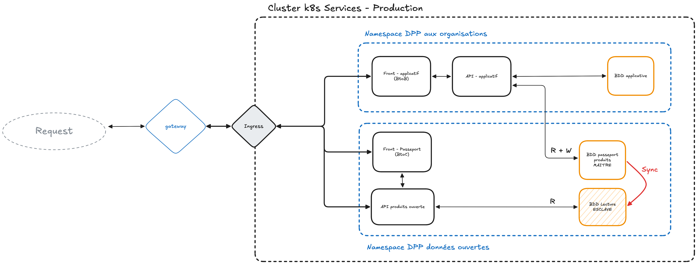

# ITER 
## Contexte
Iter est un passport produit numérique en relation avec l'article [1781 de l'ESPR](https://eur-lex.europa.eu/eli/reg/2024/1781/oj/eng).
Dans sa version brut il permet d'accéder aux passe-port produit d'articles où sont affichés des données tel que la **provenance des matières premières**, l'**origine des fournisseurs**, des liens vers des informations de **réparabilité** etc.
## Installation
### Local
Le lancement de l'application se fait en local avec docker:
```bash
git clone git@github.com:Marguillat/iter-open-api.git
cd iter-open-api
# utilise le compose.yml
docker compose up
```
## Architecture visée:
Architecture cloud visée :

### Implémentation
- [/] Base de donnée
	- [/] applicative
	- [x] passe-port
- [/] Api 
	- [x] passport ouvert
	- [/] applicative
	- [x] swagger-ui
- [/] Frontend
	- [/] Passport ouvert
	- [/] Applicatif
### ADR1
#### Contexte
Les APIs doivent être scalables et facilement déployables sur un environnement simple et léger.
#### Décision
Utilisation de **Golang** et **Fiber** comme stack de l'application api.
#### Conséquences
+ vitesse d'execution
+ concurrency
+ qu'un seul executable
- ecosystème plus limité
### ADR2
#### Contexte
La base de données doit être simple mais exetensible et gérer des types complexes et modernes.
#### Décision
Utilisation de **PostgreSQL** comme SGBR.
#### Conséquences
+ Standard de l'industrie
+ Types complexes
+ Support de la réplication maitre/esclave
+ Beaucoup d'extensions et support natif 
## Déploiement
Etapes:
1. Créer une branche : `feature/<nom-de-la-feature>`
2. Push les changements sur la branche distante
3. Créer une merge request sur la branche de l'environnement choisi : `main` , `develop` ...
4. (La MR doit être approuvée avant déploiement)
5. execution du déploiement
## Règles de contribution
Linting :
- utilisation des tabulation pour le code `Golang`
- pour les langages qui utilisent des espaces, mettre **`2`** espaces
## Runbooks

### Runbook : PostgreSQL down

#### Détection
- Connexion base de données échoue dans les logs de l'API
- Grafana : conteneur PostgreSQL absent ou en erreur
- API retourne `connection refused` ou `EOF`

#### Diagnostic
1. Vérifier l'état des conteneurs : `docker compose ps`
2. Consulter les logs PostgreSQL : `docker compose logs postgres`
3. Vérifier l'espace disque : `docker exec iter-postgres-1 df -h /var/lib/postgresql/data`
4. Vérifier les connectivité réseau : `docker compose exec api ping postgres`

#### Mitigation
- Conteneur arrêté → redémarrer : `docker compose up -d postgres`
- Seed data manquantes → relancer les migrations : `docker compose exec api ./migrate-up.sh`
- Espace disque plein → nettoyer les logs : `docker exec iter-postgres-1 vacuumdb -U postgres -d iter_db`
- Corruption DB → restaurer depuis backup : voir documentation backups
- Vérifier la santé après redémarrage : `docker compose exec api curl http://localhost:8080/health`

---

### Runbook : Erreur de déploiement

#### Détection
- GitHub Actions build échoue sur branche `main`
- Nouveau déploiement ne démarre pas ou crash immédiatement
- Logs de déploiement montrent erreur d'image ou conteneur

#### Diagnostic
1. Consulter les logs GitHub Actions sur le repository
2. Vérifier le dernier commit : `git log --oneline -n 5`
3. Vérifier les erreurs de build : `docker compose build --no-cache api` (en local)
4. Vérifier les logs du conteneur : `docker compose logs api` (pour les 50 dernières lignes : `docker compose logs --tail=50 api`)
5. Vérifier les variables d'environnement : `docker compose config` (masque les secrets)

#### Mitigation
- Erreur de linting Golang → corriger le code et repousser
- Dépendances manquantes → mettre à jour `go.mod` et `go.sum`
- Build image échouée → nettoyer les images : `docker image prune -a` et relancer
- Incompatibilité env variables → vérifier `.env` et `.env.prod`
- Rollback dernier déploiement : 
  - Identifier le dernier commit stable : `git log --oneline`
  - Revenir à ce commit : `git revert <commit-hash>` ou `git reset --hard <commit-hash>`
  - Pusher sur `main` → GitHub Actions redéploiera la version précédente
- Vérifier la santé après déploiement : `curl https://<vps-ip>/health`

## Liens utiles
- [Grafana vps](https://shorttrawler3027.grafana.net/d/manht6g/conteneurs-vps?orgId=1&from=now-12h&to=now&timezone=browser&var-container=$__all&refresh=1m)
- [Alertes grafana](https://shorttrawler3027.grafana.net/alerting/grafana/namespaces/fc86w9/groups/vps%20container/view)
- [Snyk](https://app.snyk.io/org/marguillat/projects?groupBy=targets&before&after&searchQuery=&sortBy=highest+severity&filters[Show]=&filters[Integrations]=&filters[CollectionIds]=)
- [Sonarqube](https://sonar.erwan.duchene.mds-nantes.fr/dashboard?id=Marguillat_iter-open-api_c71af3b1-3e57-4a62-8673-d1e7e0e6ccf6)
